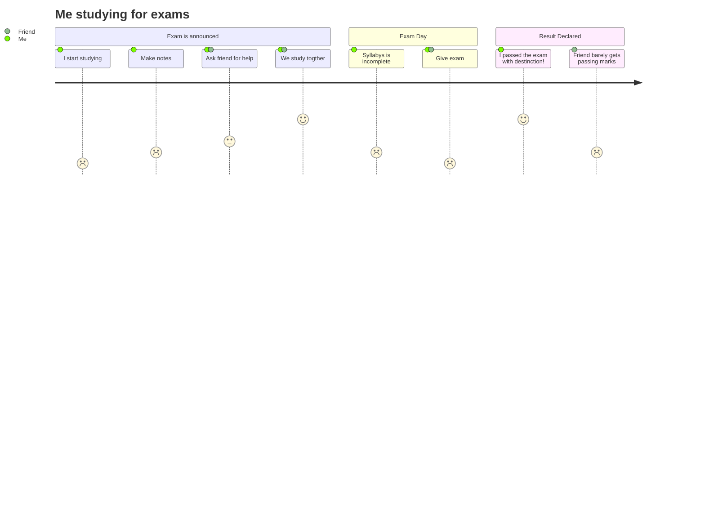

# Unity WebGL: Automatic build and gh-pages deployment

This repository contains a Unity WebGL project that is automatically built by using Github Actions and following certain rules.

Based on [GameCI](https://game.ci/docs/github/getting-started/)

```mermaid
flowchart LR
    A[Checkout Repository] --> B[Create LFS File list]
    B --> C[Restore LFS cache]
    C --> D[Git LFS Pull]
    D --> E[Cache]
    E --> F[Build project]
    F --> G[Upload Build Artifact]
    G --> H[Stash build result and reset local changes]
    H --> I[Cleaning gh-pages branch]
    I --> J[Applying stashed files to gh-pages]
    J --> K[Moving files to root directory]
    K --> L[Pushing to gh-pages]
```

## SUPPORT

It only supports **WebGL not compressed builds**.

## REQUIREMENTS

### Acquire Activation File
[GameCI Documentation](https://game.ci/docs/github/activation).

## OUTPUT

### Artifact
Downloadable zip with the build files.

### Automatic deployment to Github Pages
Build content is deployed to the target branch, where Github pages should be pointing to.

## CONFIGURABLE

It is based on the use of repo enviroment variables:

- TARGET_PLATFORM
- BUILD_PATH
- ARTIFACT_NAME
- DEPLOYMENT_BRANCH

