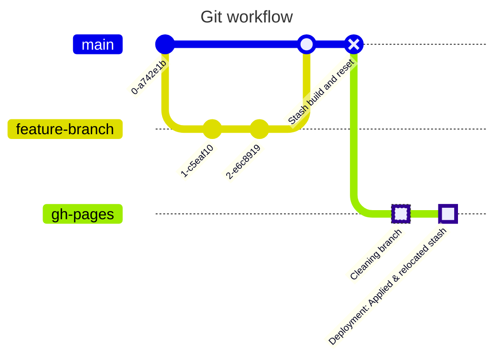
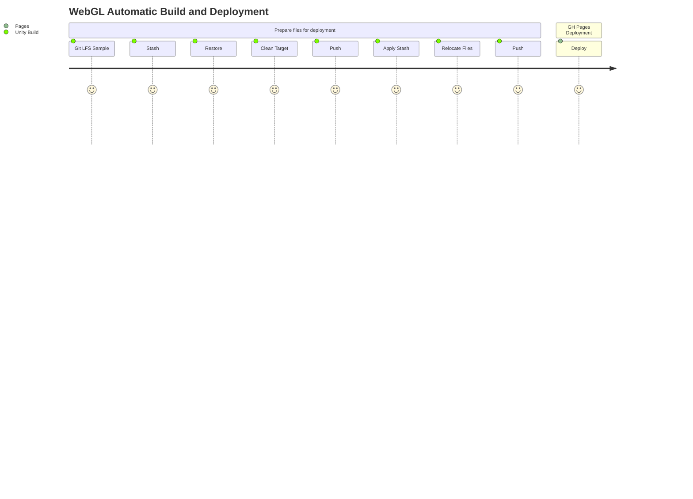

# Unity WebGL: Automatic build and Pages deployment

This repository contains a Unity WebGL project that is automatically built and deployed to Github Pages when a pull request to main is created.

- Using [Github Actions](https://github.com/features/actions)
- Based on [GameCI](https://game.ci/docs/github/getting-started/)
- Configurable

## Target platforms and supported tools

| **Git LFS** |    **WebGL**   | **Standalone** | **iOS** | **Android** |
|-------------|:--------------:|:--------------:|:-------:|:-----------:|
| X           |        X       |                |         |             |
|             | Not Compressed |                |         |             |

## Output

 - **Artifact:** Downloadable zip with the build files.

 - **Automatic deployment to Github Pages:** Build content is deployed to the target branch, where Github pages should be pointing to.

## Setup guide

### Assumptions
- Target repo already created.
- Target repo contains a gitignore file.
- Git LFS is configured.

### Steps

#### Adding necessary files to the repo
1. Create a .github folder
2. Create a workflows folder inside of the recently created .github folder
3. Download the [main](file:///d:/.github/workflows/main.yml) and the [activation](file:///d:/.github/workflows/activation.yml) files and add them to the workflow folder.

#### Setup Pages and set source
1. DEPLOYMENT_BRANCH: Create the branch where you want to host your deployed WebGL site.
2. Enable pages and set the DEPLOYMENT_BRANCH as the build and deployment source.

#### Acquire the activation file
Execute the Acquire Activation File job included in the activation.yml file manually from the Actions tab and [GameCI Documentation](https://game.ci/docs/github/activation).

#### Setup repository variables
- TARGET_PLATFORM: Unity project build target platform
- BUILD_PATH: Were the build will be created. This folder should not be included in the .gitignore file.
- ARTIFACT_NAME: The output zip file name.
- DEPLOYMENT_BRANCH: The source branch for Github Pages.

## Unity Build job details

