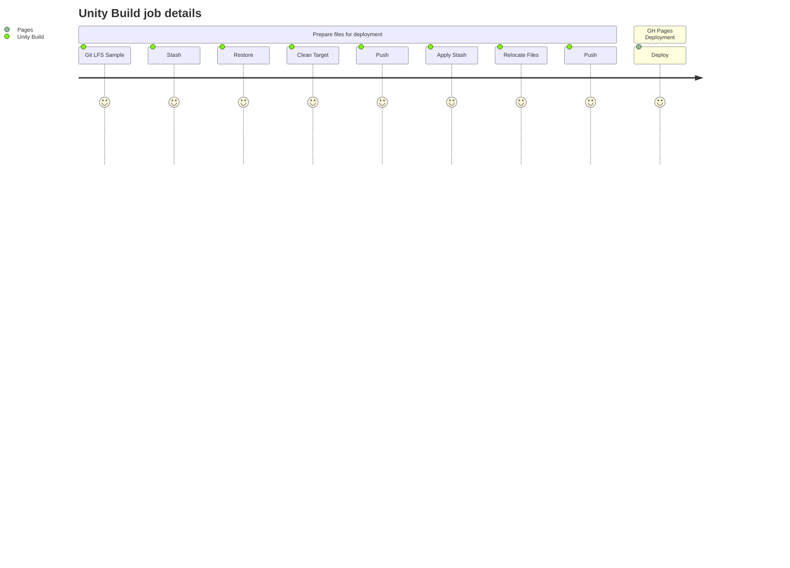
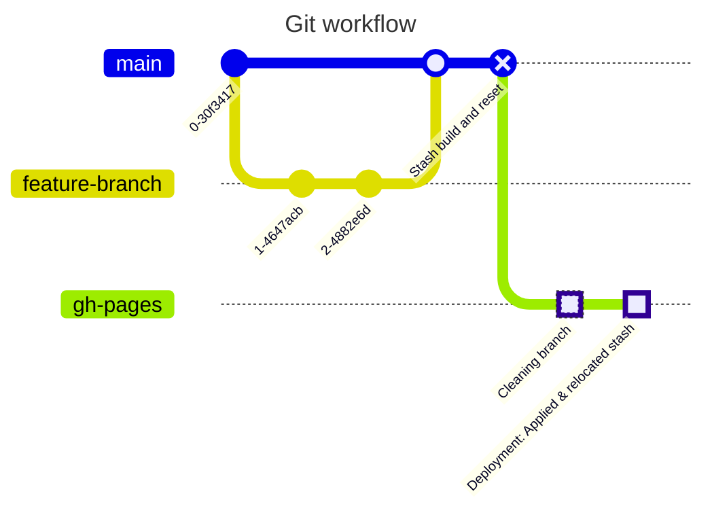

# Unity WebGL: Automatic build and Pages deployment

This repository contains a Unity WebGL project that is automatically built and deployed to Github Pages when a pull request to main is created.

```mermaid
journey
	title Unity Build job details
	section Prepare files for deployment
        Git LFS Sample:6: Unity Build
		Stash:6: Unity Build
        Restore:6: Unity Build
		Clean Target: 6: Unity Build
        Push: 6: Unity Build
        Apply Stash: 6: Unity Build
        Relocate Files: 6: Unity Build
        Push: 6: Unity Build
    section GH Pages Deployment
        Deploy: 6: Pages
```

- Using [Github Actions](https://github.com/features/actions)
- Based on [GameCI](https://game.ci/docs/github/getting-started/)
- Configurable

## Target platforms and supported tools

| **Git LFS** |    **WebGL**   | **Standalone** | **iOS** | **Android** |
|-------------|:--------------:|:--------------:|:-------:|:-----------:|
| X           |        X       |                |         |             |
|             | Not Compressed |                |         |             |

## Output

 - **Artifact:** Downloadable zip with the build files.

 - **Automatic deployment to Github Pages:** Build content is deployed to the target branch, where Github pages should be pointing to.

```mermaid
---
title: Git workflow
---
gitGraph
   commit
   branch feature-branch
   checkout feature-branch
   commit
   commit
   checkout main
   merge feature-branch
   commit id: "Stash build and reset" type: REVERSE
   branch gh-pages
   checkout gh-pages
   commit id: "Cleaning branch" type: HIGHLIGHT
   commit id: "Deployment: Applied & relocated stash" type: HIGHLIGHT
```

## Setup guide

### Assumptions
- Target repo already created.
- Target repo contains a gitignore file.
- Git LFS is configured.

### Steps

#### Pipeline prerequisites
- **Unity license activation**: Request a personal license and generate the `UNITY_LICENSE` file following the [GameCI activation guide](https://game.ci/docs/github/activation).
- **GitHub secrets**: Create the following repository secrets so the workflow can authenticate with Unity and GitHub:
  - `PAT`: Personal access token with `repo` scope to allow pushing to the deployment branch.
  - `UNITY_LICENSE`, `UNITY_EMAIL`, `UNITY_PASSWORD`: Credentials required by the Unity Builder action.
  - `GH_EMAIL`, `GH_USERNAME`: Identity used when the workflow commits deployment changes.

#### Adding necessary files to the repo
1. Create a .github folder
2. Create a workflows folder inside of the recently created .github folder
3. Download the [main](file:///d:/.github/workflows/main.yml) and the [activation](file:///d:/.github/workflows/activation.yml) files and add them to the workflow folder.

#### Setup Pages and set source
1. DEPLOYMENT_BRANCH: Create the branch where you want to host your deployed WebGL site.
2. Enable pages and set the DEPLOYMENT_BRANCH as the build and deployment source.

#### Acquire the activation file
Execute the Acquire Activation File job included in the activation.yml file manually from the Actions tab and [GameCI Documentation](https://game.ci/docs/github/activation).

#### Configure pipeline variables
Define the following repository variables from **Settings → Secrets and variables → Actions → Variables** so the workflow can locate build outputs and target branch information:
- `TARGET_PLATFORM`: Unity project build target platform.
- `BUILD_PATH`: Directory where the build will be created. This folder should not be ignored by git.
- `ARTIFACT_NAME`: The output zip file name.
- `DEPLOYMENT_BRANCH`: The source branch for Github Pages deployments.

